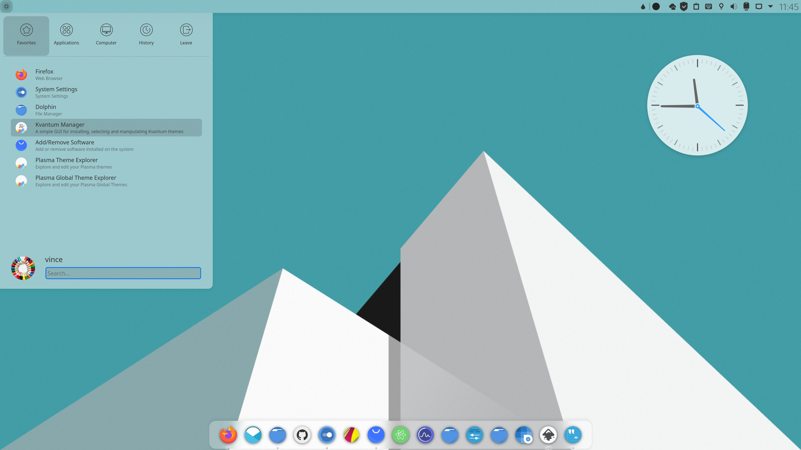
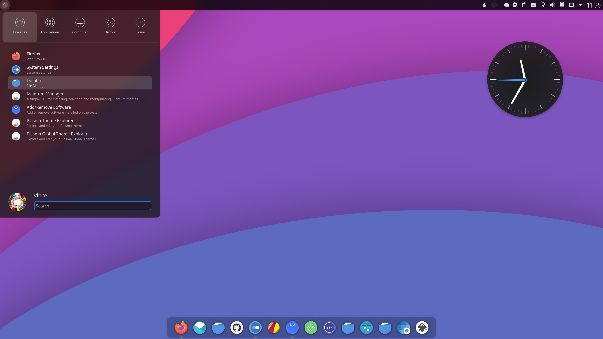

Orchis kde is a materia Design theme for KDE Plasma desktop.

In this repository you'll find:

- Aurorae Themes
- Kvantum Themes
- Plasma Color Schemes
- Plasma Desktop Themes
- Plasma Look-and-Feel Themes

## Installation

```sh
./install.sh
```

## Recommendations

- For better looking please use this pack with [Kvantum engine](https://github.com/tsujan/Kvantum/tree/master/Kvantum).

  Run `kvantummanager` to choose and apply **ChromeOS** theme.

- Install [Tela circle icon theme](https://github.com/vinceliuice/Tela-circle-icon-theme) for a more consistent and beautiful experience.

## Donate

If you like my project, you can donate at:

<span class="paypal"><a href="https://www.paypal.me/vinceliuice" title="Donate to this project using Paypal"></a></span>

## License

GNU GPL v3

## preview



